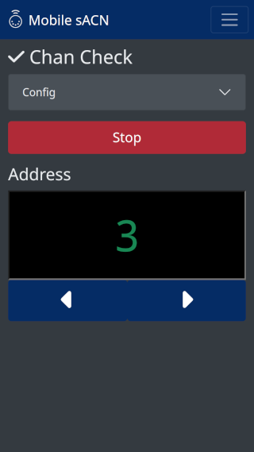
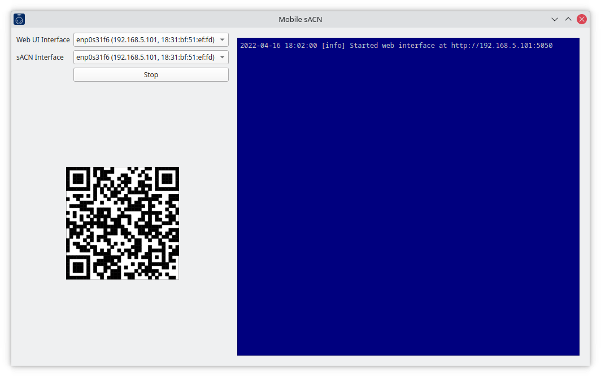

Mobile sACN
===========

Mobile sACN allows remote troubleshooting of sACN signals. Your mobile device
connects to a program on your computer that handles functions as the sACN
transceiver. This reduces wireless network bandwidth and configuration
requirements considerably.

*THIS IS PRERELEASE SOFTWARE STILL UNDERGOING DEVELOPMENT!*  See current
development builds [here](https://github.com/danielskeenan/mobile_sacn/releases/tag/dev-latest).

Requirements
------------

- A computer with network access.
- Mobile device with a web browser.

Usage
-----

1. Start the program. Select the network interfaces that will run the web UI
   and sACN.
    - If you're on a lighting network without WiFi, consider using the WiFi
      sharing feature built in to your operating system. The WiFi interface will
      handle the web UI and the wired interface will run sACN.
    - If your network has WiFi, select the same interface for both options.
2. Click "Start" and use your mobile device's camera to scan the QR code and
   open the web UI.

Issues
------
Please report any issues via the [GitHub Issue Tracker](https://github.com/danielskeenan/mobile_sacn/issues).
