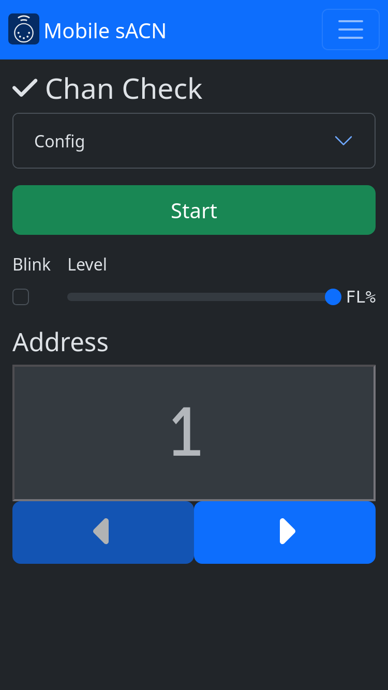
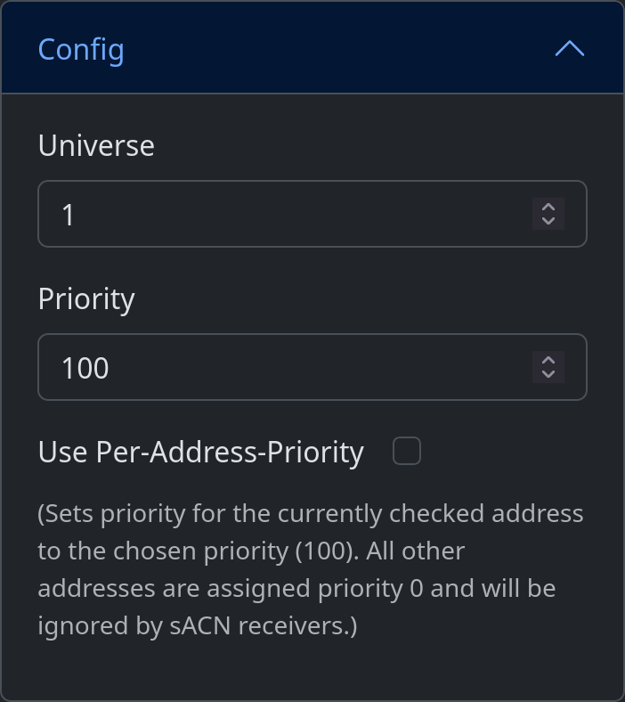
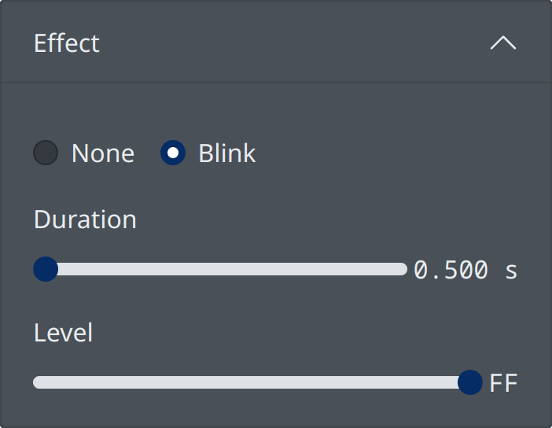

.. |btn_left| button::
   :color: primary

   .. image:: /img/icons/caret-left-solid.svg

.. |btn_right| button::
   :color: primary

   .. image:: /img/icons/caret-right-solid.svg

.. |btn_start| button::
   :color: success

   Start

.. |btn_stop| button::
   :color: danger

   Stop

.. index:: Channel Check

.. _chancheck:

Channel Check
=============

Channel Check mode allows you to set a single address to a defined level, moving through the universe sequentially.

   Channel Check screen

.. contents::
   :local:

Usage
-----

1. Set the level you wish to set the checked address to using the Level fader.

   .. image:: screenshots/level.png
      :class: screenshot

2. Use |btn_right| and |btn_left| buttons to set the first address
   to check.
3. Press |btn_start| to begin transmitting.
4. The current address will be displayed in green while the program is transmitting:

   .. figure:: screenshots/addr_transmit.png
      :class: screenshot

      Transmitting

   .. figure:: screenshots/addr_notransmit.png
      :class: screenshot

      Not transmitting

5. Press |btn_stop| to stop transmitting.

   .. note:: If this program was the only device transmitting sACN on the network, receivers will follow their
      programmed data loss behavior. This means that lights may not turn off immediately.

.. _chancheck-config:

Config
------

   Configuration menu

Universe
   .. _chancheck-config-universe:

   sACN universe to broadcast on.

Priority
   .. _chancheck-config-priority:

   sACN priority. Levels with higher priority will take precedence over levels with lower priority. If two
   sources are broadcasting with the same priority, the highest level will take precedence. The default priority on most
   sACN sources, including this program, is ``100``.

Use Per-Address-Priority
   .. _chancheck-config-pap:

   When enabled, the priority setting will be applied to only the address currently being
   checked. This mode is generally only compatible with sACN receivers designed by ETC (including dimmers and gateways),
   as it is a proprietary extension to the sACN standard. Receivers that do not understand per-address-priority will
   behave as if the priority setting is applied to the entire universe.

.. index:: Effects

.. _chancheck-effect:

Effect
------

.. _chancheck-effect-none:

None
^^^^

No effect will be applied to the output. The address will be set to the configured level and will return to zero when a
different address is selected.

.. index:: Blink

.. _chancheck-effect-blink:

Blink
^^^^^

The address will flash at the selected rate.

   Blink configuration menu

Duration
   .. _chancheck-effect-blink-duration:

   The amount of time to wait before turning on/off.

Level
   .. _chancheck-effect-blink-level:

   The *on* level. The *off* level comes from the main level fader outside the effect configuration.

Tips
----

Channel checking a system in use
^^^^^^^^^^^^^^^^^^^^^^^^^^^^^^^^

If you must check a system that is in use by others and you don't want to disturb other levels, use the
per-address-priority option and Blink effect:

1. Set the priority to ``200``.
2. Enable :ref:`per-address-priority <chancheck-config-pap>`.
3. Set the level to ``20%`` (or some other low level).
4. Enable the :ref:`chancheck-effect-blink` effect. Set the blink level to ``100%``
5. Press |btn_start|.

The address currently being checked will blink, while all others will remain at their previous level.
