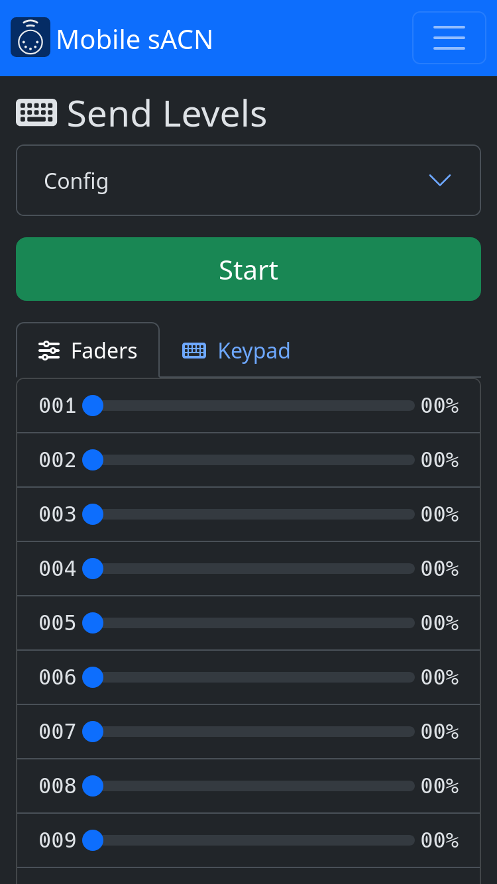
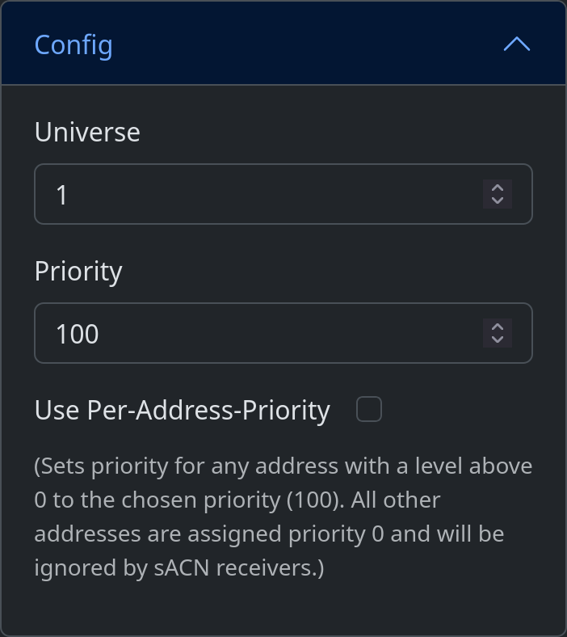
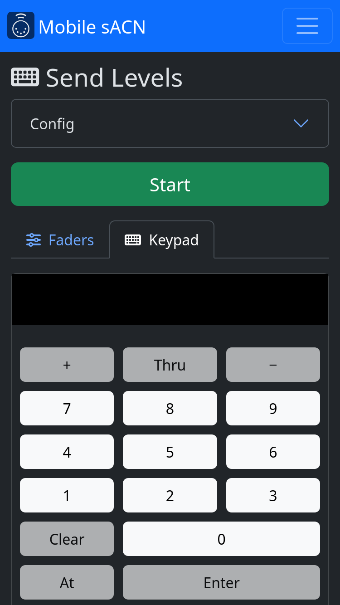

.. index:: Control

.. _control:

Level Control
=============

Control mode allows you to set levels for individual addresses.  Only one universe may be controlled at a time.

   Control screen

.. contents::

Usage
-----

1. Select the universe in the :ref:`Config <control-config-universe>` menu.
2. Press |button_start|.
3. Adjust levels.
4. Press |button_stop| to stop transmitting.

   .. note:: If this program was the only device transmitting sACN on the network, receivers will follow their
      programmed data loss behavior. This means that lights may not turn off immediately.

.. _control-config:

Config
------

   Configuration menu

Universe
   .. _control-config-universe:

   sACN universe to broadcast on.

Priority
   .. _control-config-priority:

   sACN priority. Levels with higher priority will take precedence over levels with lower priority. If two
   sources are broadcasting with the same priority, the highest level will take precedence. The default priority on most
   sACN sources, including this program, is ``100``.

.. _control-modes:

Modes
-----

Multiple control modes are available.  Set levels are retained when switching control modes.

.. index:: Faders

.. _control-modes-faders:

Faders
^^^^^^

Press |button_faders| to show faders mode.

   Faders mode

The faders mode presents each address as a fader.  Slide the fader from left (zero) to right (full) to adjust the level.

.. index:: Keypad

.. _control-modes-keypad:

Keypad
^^^^^^

Press |button_keypad| to show keypad mode.

   Keypad mode

The keypad mode allows more fine-grained control of levels.  Set levels using the keypad as you would on a command-line
lighting console, like the ETC Eos family.

To assist entering correct commands, buttons that are not allowed for the current command line are shaded a darker color
and cannot be pressed.

All commands must be committed by pressing :kbd:`Enter`.  Press :kbd:`Clear` to backspace.  If the current command line
has been committed (i.e. the last button pressed was :kbd:`Enter`), pressing any button will begin a new command line.

Some example command lines:

.. Each keystroke must be its own :kbd: element to be formatted correctly.

* :kbd:`1` :kbd:`At` :kbd:`1` :kbd:`0` :kbd:`0` :kbd:`Enter` sets address 1 to full.
* :kbd:`1` :kbd:`Thru` :kbd:`5` :kbd:`At` :kbd:`5` :kbd:`0` :kbd:`Enter` sets addresses 1, 2, 3, 4, and 5 to 50.
* :kbd:`1` :kbd:`+` :kbd:`3` :kbd:`At` :kbd:`5` :kbd:`0` :kbd:`Enter` sets addresses 1 and 3 to 50.
* :kbd:`1` :kbd:`Thru` :kbd:`5` :kbd:`-` :kbd:`3` :kbd:`At` :kbd:`5` :kbd:`0` :kbd:`Enter` sets addresses 1, 2, 4, and 5
  to 50.
* :kbd:`1` :kbd:`Thru` :kbd:`5` :kbd:`+` :kbd:`1` :kbd:`0` :kbd:`At` :kbd:`5` :kbd:`0` :kbd:`Enter` sets addresses 1, 2,
  3, 4, 5, and 10 to 50.
* :kbd:`1` :kbd:`At` :kbd:`+` :kbd:`1` :kbd:`0` :kbd:`Enter` sets address 1 to 10 points above its current level.
* :kbd:`1` :kbd:`At` :kbd:`-` :kbd:`5` :kbd:`Enter` sets address 1 to 5 points below its current level.
* :kbd:`1` :kbd:`Thru` :kbd:`5` :kbd:`At` :kbd:`1` :kbd:`0` :kbd:`Thru` :kbd:`5` :kbd:`0` :kbd:`Enter` sets address 1 to
  10, 2 to 20, 3 to 30, 4 to 40, and 5 to 50.
