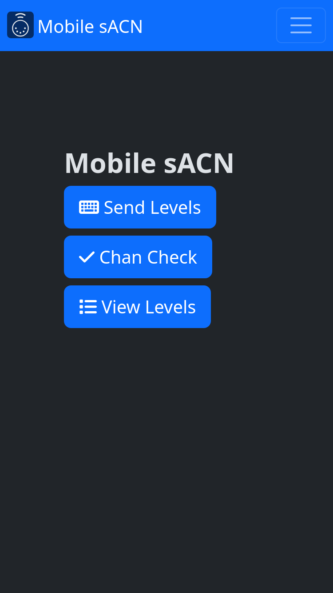

.. index:: Main navigation

Usage
=====

.. toctree::
   :maxdepth: 2
   :titlesonly:
   :glob:

   chancheck/*
   control/*

All modes are accessible from the main screen and from the |button_menu| button on the top right.  You can always
navigate back to the main screen by pressing |button_main|.

   Main navigation
