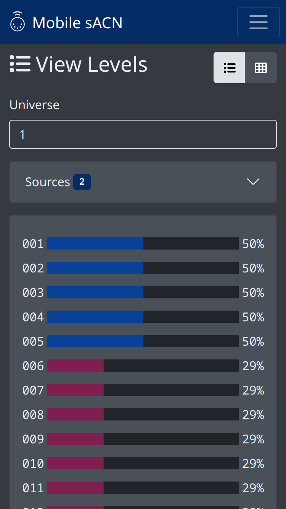
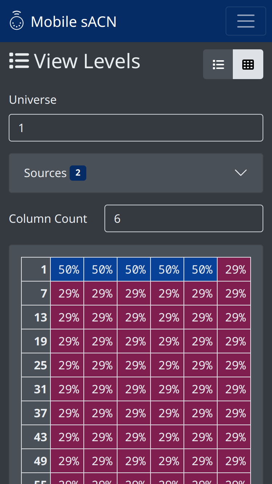

.. |btn_univ| button::
   :color: outline-secondary

   Choose Universe...

.. |btn_list| button::
   :color: secondary

   .. image:: /img/icons/list-solid.svg

.. |btn_grid| button::
   :color: secondary

   .. image:: /img/icons/table-cells-solid.svg

.. index:: View Levels

.. _viewlevels:

View Levels
===========

View Levels mode shows all sACN levels on the network and their merge result.

   View Levels screen

.. contents::
   :local:

Usage
-----

If any sACN sources are active on the network, their levels are shown for the given universe.  If more than one sACN
source is active, the levels from all sources is merged following the standard sACN merge rules.  Each source is
assigned a different color; the color legend is shown by opening the "Sources" dropdown.

Universe Discovery
^^^^^^^^^^^^^^^^^^

Discovered sACN universes are shown as buttons. There is a small delay (usually around 10 seconds, but depends on the
transmitters) from entering View Levels mode and universe discovery. Additionally, not all sACN transmitters make their
transmitted universes discoverable. To select a universe that has not been discovered, press |btn_univ|.

.. _viewlevels-modes:

Modes
-----

Multiple display modes are available:

.. _viewlevels-modes-list:

Bars
^^^^

Press |btn_list| to show bars mode.

   Bars mode

The given universe is shown as a list of bars, where each address has a bar showing its current level.  The color of the
bar corresponds to the color of the winning source. The address is shown on the left of the bar. The level and priority
are shown on the right.

.. _viewlevels-modes-grid:

Grid
^^^^

Press |btn_grid| to show grid mode.

   Grid mode

The given universe is shown as a grid with the first address in each row shown on the left. Much like
:ref:`Bars mode <viewlevels-modes-list>`, the color of the box corresponds to the color of the winning source. In each
box, the level is shown above the priority.
